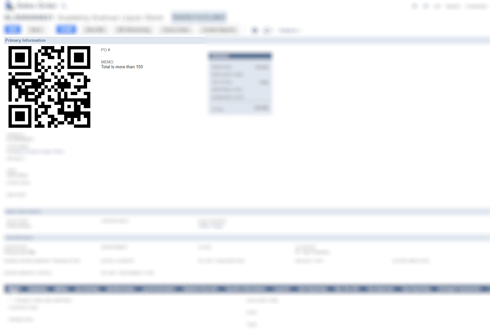
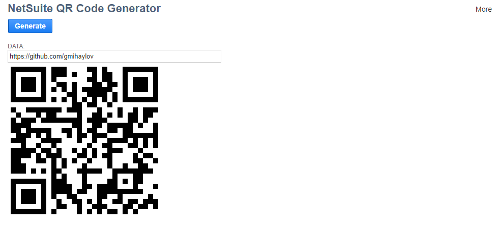

# NetSuite QR Code Generator
Simple SDF project that demonstrates how to create & render server side generated QR code within NetSuite.

## Example:

## Deployment
- NetSuiteQRCodeGenerator_UE is deployed on the Sales Order record, but can be deployed on any other transaction or/and custom record.
- The QR code is generated on beforeLoad (scriptContext.UserEventType.VIEW) and rendered in the INLINEHTML field.
- QR code is generated on-the-fly, at the server side.
- QR code can show any data you want (this can be customized in getData() function).
- NetSuiteQRCodeGenerator_SL just show how to implement the QR code in Suitelets.

## Usage
How to customize QR code output:
- In NetSuiteQRCodeGenerator_UE, getData function:

  - Uncomment this line if you want to generate QR code for the transaction URL:
    - ``return resolveRecordUrl(newRecord.type, newRecord.id);``
  - Uncomment this line if you want to generate QR code for the Transaction ID:
    - ``return newRecord.getValue({fieldId: 'tranid'});``
  - Uncomment this line if you want to generate QR code for the memo field value (default):
    - ``return newRecord.getValue({fieldId: 'memo'});``
  - Want to customize more? Just write your code in getData() and use your imagination:
    - ``return "Here is my QR code!"``
    - or
    - ``return 'This is a generated QR code for ' + newRecord.getValue({fieldId: 'anyOtherField'});``
- How to make the QR code bigger?
  - Increase value of CELL_SIZE in NetSuiteQRCodeGenerator_UE.

## Input / Output
Input (as string): 

``Total is more than 100``

Output:

``data:image/gif;base64,R0lGODdhBgEGAYA ... some data omitted ... IWUAAAOw==``

Output format (Base64 encoded GIF):

## Credits
- QR Code Generator for JavaScript (http://www.d-project.com/)

## Screenshots

